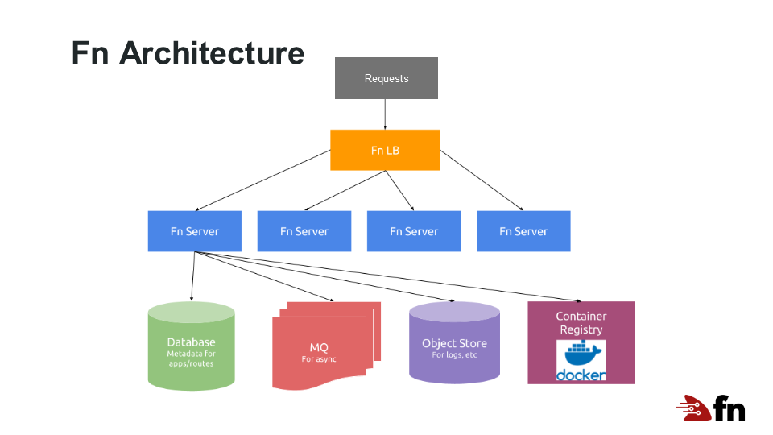

# Fn Project 가 무엇인가?
Fn Project는 4개의 주요 컴포넌트로 이루어져 있다.

1. Fn Server

    개발자가 자신의 기능을 멀티 클라우드 환경으로 쉽게 구축, 배포 및 확장 할 수 있도록 지원하는 기능형 서비스 시스템이다. 빠르고 신뢰할 수 있고 확장 가능하며 컨테이너 기반이다.

1. Fn Load Balancer

    운영자가 Fn 서버의 클러스터를 배치하고 트래픽을 지능적으로 라우팅할 수 있다. 가장 중요한 점은 특정 기능에 대한 트래픽이 증가하면 부하를 분산할 뿐만 아니라 최적의 성능을 보장하기 위해 빨리 수행가능한 노드로 트래픽을 라우팅한다. 또한 전체 클러스터에 대한 정보를 수집하여 Fn 서버추가 또는 Fn 서버축소를 알 수 있다. 

1. Fn FDK

    Java 부터는 모든 언어로 함수를 신속하게 부트 스트랩하고, 함수 입력을 위한 데이터 바인딩 모델을 제공하고, 함수를 더 쉽게 테스트하고 기초를 마련하기 위한 목적으로 FDK 또는 Function Development Kit을 출시하였다.

1. Fn Flow

    개발자는 자신이 선택한 프로그래밍 언어 안에서 모든 기능의 상위 레벨 워크플로우를 구축하고 조율할 수 있다. 긴 json 또는 yaml 템플릿으로 구축된 복잡한 외부 모델을 배우지 않고도 병렬처리, 시퀀싱/체인화, 오류처리, 입출력 등을 쉽게 사용할 수 있다. 무엇보다다도 Flow 는 모든 함수 호출 그래프를 추적하여 대시보드에서 시각화, 전체 Flows의 전체 스택 로그 및 전체 기능 그래프에서의 변수/메모리 재구성을 허용한다.
    

# Fn Project 아키텍처
Fn Project의 전체적인 아키텍처는 다음과 같다.

- Load Balancer

    어떠한 로드밸런스도 동작한다. Fn의 인스턴스 한테 로드밸런스를 통해서 요청이 가도록 한다.

- Database

    작은 데이터베이스를 사용하고 있다. request/response 시에 어떠한 것도 쓰여지지 않으며 쉽게 플러거블 하다.

- Message Queue

    메시지 큐는 리소스가 가능할 때 까지 프로세싱을 위해 버퍼링을 하기위해  비동기 호출에서 가장 중요한 부분을 차지 한다. 

    메시지 역시 플러거블 하며 현재는 몇가지의 옵션만을 제공한다.

- Logging, Metrics and Monitoring

    로깅 또한 매우 중요한 부분이다.  [logspout-statsd](https://github.com/treeder/logspout-statsd)를 사용하여 로그로 부터 매트릭스를 수집할 수도 있다.

- Scaling

    로그에 메트릭스가 생성되어 스케일링 할 때 사용자에게 알릴 수 있다. 대부분의 중요한 것은 동기와 비동기 functions 모두에게서 중요한 것은 *wait_time* 매트릭이다. 만약 *wait_time* 이 증가되면 더 많은 Fn 인스턴스를 시작해야 한다.

# Fn 설치
## 요구사항
- Docker 17.05 이상
- Docker Hub account 
## 다운로드
- Homebrew - MacOS
    ~~~sh
    brew install fn
    ~~~
- Shell script - Linux/MacOS
    ~~~sh
    curl -LSs https://raw.githubusercontent.com/fnproject/cli/master/install | sh
    ~~~
- Windows

    ~~~sh
    https://github.com/fnproject/cli/releases
    ~~~

# Fn 시작하기
다운받은 fn 을 수행하면 다음과 같이 나온다.
~~~
$ fn

Fn Command Line Tool  -  Version 0.5.92

ENVIRONMENT VARIABLES
  FN_API_URL      Fn server address
  FN_REGISTRY     Docker registry to push images to, use username only to push to Docker Hub - [[registry.hub.docker.com/]USERNAME]

GENERAL COMMANDS
  version         Display Fn CLI and Fn Server versions
  help, h         Shows a list of commands or help for one command

DEVELOPMENT COMMANDS
  build, bu            Build function version
  bump, bm             Bump function version
  deploy, dp           Deploys a function to the functions server (bumps, build, pushes and updates functions and/or triggers).
  init, in             Create a local func.yaml file
  invoke, iv           Invoke a remote function
  migrate, m           Migrate a local func.yaml file to the latest version
  push, p              Push function to docker registry

MANAGEMENT COMMANDS
  config, cf           Set configuration for an object
  create, c            Create a new object
  delete, d            Delete an object
  get, g               Get an object to retrieve its information
  inspect, i           Retrieve properties of an object
  list, ls             Return a list of created objects
  unset, un            Unset elements of a created object
  update, up           Update a created object
  use, u               Select context for further commands

SERVER COMMANDS
  build-server         Build custom Fn server
  start                Start a local Fn server
  stop                 Stop a function server

GLOBAL OPTIONS
  --context value      Use --context to select context configuration file [$FN_CONTEXT]
  --registry value     Use --registry to select registry
  --verbose, -v        Use --verbose to enable verbose mode for debugging
  --help, -h           show help
  --version            Display version

FURTHER HELP:  See 'fn <command> --help' for more information about a command.

LEARN MORE:    https://github.com/fnproject/fn
~~~
명령어 중 몇가지를 보면 다음과 같다.

- start : Function App을 등록하여 운영하는 서버를 실행 (fn start)
- init : 새로운 Function App을 생성 (fn init --runtime java)
- update : fn Project 의 최신버젼으로 업데이트
- apps : 디플로이된 fn application 관리 (fn apps lsit)
- routes : 호출할 application 라우터 관리 (fn routes list hello)
- images : application을 관리 (fn images build / fn images push)
- calls : 호출된 application 기록 보기 (fn calls list hello)
- logs : fn application의 로그 보기 (fn logs get hello 01C4Q8E0WT47WWW00000000000)
- test : fn application을 테스트 (fn test)

## Fn Server 시작

로컬에서 Fn Server를 수행한다.

~~~sh
$ fn start
~~~
실행을 하면, docker fn server 에 대한 docker image를 다운로드 받고 Container를 시작한다.
~~~
2020/01/31 10:49:03 ¡¡¡ 'fn start' should NOT be used for PRODUCTION !!! see https://github.com/fnproject/fn-helm/
Unable to find image 'fnproject/fnserver:latest' locally
latest: Pulling from fnproject/fnserver
ff3a5c916c92: Pull complete
1a649ea86bca: Pull complete
ce35f4d5f86a: Pull complete
b6206661264b: Pull complete
b8b71dba24d3: Pull complete
3873004a68ee: Pull complete
f4205b132661: Pull complete
91a85eeeb257: Pull complete
93c96d032b32: Pull complete
bb761748d6e1: Pull complete
81f6c51c4ac2: Pull complete
2ba715696dba: Pull complete
f46c2b56aaf3: Pull complete
aef258868c13: Pull complete
9a72ccea4c0a: Pull complete
Digest: sha256:34a51ad87dbe9e360ad194556f3cc21b6a75d73e41abd7d541a223beeb7f7271
Status: Downloaded newer image for fnproject/fnserver:latest
time="2020-01-31T01:49:39Z" level=info msg="Setting log level to" fields.level=info
time="2020-01-31T01:49:39Z" level=info msg="Registering data store provider 'sql'"
time="2020-01-31T01:49:39Z" level=info msg="Connecting to DB" url="sqlite3:///app/data/fn.db"
time="2020-01-31T01:49:39Z" level=info msg="datastore dialed" datastore=sqlite3 max_idle_connections=256 url="sqlite3:///app/data/fn.db"
time="2020-01-31T01:49:39Z" level=info msg="agent starting cfg={MinDockerVersion:17.10.0-ce ContainerLabelTag: DockerNetworks: DockerLoadFile: DisableUnprivilegedContainers:false FreezeIdle:50ms HotPoll:200ms HotLauncherTimeout:1h0m0s HotPullTimeout:10m0s HotStartTimeout:5s DetachedHeadRoom:6m0s MaxResponseSize:0 MaxHdrResponseSize:0 MaxLogSize:1048576 MaxTotalCPU:0 MaxTotalMemory:0 MaxFsSize:0 MaxPIDs:50 MaxOpenFiles:0xc420353238 MaxLockedMemory:0xc420353250 MaxPendingSignals:0xc420353258 MaxMessageQueue:0xc420353260 PreForkPoolSize:0 PreForkImage:busybox PreForkCmd:tail -f /dev/null PreForkUseOnce:0 PreForkNetworks: EnableNBResourceTracker:false MaxTmpFsInodes:0 DisableReadOnlyRootFs:false DisableDebugUserLogs:false IOFSEnableTmpfs:false EnableFDKDebugInfo:false IOFSAgentPath:/iofs IOFSMountRoot:/Users/jonggyoukim/.fn/iofs IOFSOpts: ImageCleanMaxSize:0 ImageCleanExemptTags: ImageEnableVolume:false}"
time="2020-01-31T01:49:39Z" level=info msg="no docker auths from config files found (this is fine)" error="open /root/.dockercfg: no such file or directory"
time="2020-01-31T01:49:39Z" level=info msg="available memory" cgroup_limit=9223372036854771712 head_room=268435456 total_memory=1615843328
time="2020-01-31T01:49:39Z" level=info msg="ram reservations" avail_memory=1347407872
time="2020-01-31T01:49:39Z" level=info msg="available cpu" avail_cpu=2000 total_cpu=2000
time="2020-01-31T01:49:39Z" level=info msg="cpu reservations" cpu=2000
time="2020-01-31T01:49:39Z" level=info msg="\n        ______\n       / ____/___\n      / /_  / __ \\\n     / __/ / / / /\n    /_/   /_/ /_/\n"
time="2020-01-31T01:49:39Z" level=info msg="Fn serving on `:8080`" type=full version=0.3.749
time="2020-01-31T01:54:50Z" level=info msg="starting call" action="server.handleFnInvokeCall)-fm" app_id=01DZWMMTPXNG8G00GZJ0000001 call_id=01DZWMXMA2NG8G00GZJ0000003 container_id=01DZWMXMA3NG8G00GZJ0000004 fn_id=01DZWMQZDGNG8G00GZJ0000002
time="2020-01-31T06:23:49Z" level=info msg="starting call" action="server.handleFnInvokeCall)-fm" app_id=01DZWMMTPXNG8G00GZJ0000001 call_id=01DZX4A5V2NG8G00GZJ0000006 container_id=01DZX4A5V2NG8G00GZJ0000007 fn_id=01DZWMQZDGNG8G00GZJ0000002
time="2020-01-31T07:31:59Z" level=info msg="starting call" action="server.handleFnInvokeCall)-fm" app_id=01DZWMMTPXNG8G00GZJ0000001 call_id=01DZX86ZJPNG8G00GZJ0000009 container_id=01DZX86ZJPNG8G00GZJ000000A fn_id=01DZWMQZDGNG8G00GZJ0000002
^C2020/01/31 16:32:54 Interrupt caught, exiting
time="2020-01-31T07:32:54Z" level=info msg=Halting...
➜  ~ fn start
2020/01/31 16:39:49 ¡¡¡ 'fn start' should NOT be used for PRODUCTION !!! see https://github.com/fnproject/fn-helm/
time="2020-01-31T07:39:50Z" level=info msg="Setting log level to" fields.level=info
time="2020-01-31T07:39:50Z" level=info msg="Registering data store provider 'sql'"
time="2020-01-31T07:39:50Z" level=info msg="Connecting to DB" url="sqlite3:///app/data/fn.db"
time="2020-01-31T07:39:50Z" level=info msg="datastore dialed" datastore=sqlite3 max_idle_connections=256 url="sqlite3:///app/data/fn.db"
time="2020-01-31T07:39:50Z" level=info msg="agent starting cfg={MinDockerVersion:17.10.0-ce ContainerLabelTag: DockerNetworks: DockerLoadFile: DisableUnprivilegedContainers:false FreezeIdle:50ms HotPoll:200ms HotLauncherTimeout:1h0m0s HotPullTimeout:10m0s HotStartTimeout:5s DetachedHeadRoom:6m0s MaxResponseSize:0 MaxHdrResponseSize:0 MaxLogSize:1048576 MaxTotalCPU:0 MaxTotalMemory:0 MaxFsSize:0 MaxPIDs:50 MaxOpenFiles:0xc42003cd58 MaxLockedMemory:0xc42003cd70 MaxPendingSignals:0xc42003cd78 MaxMessageQueue:0xc42003cd80 PreForkPoolSize:0 PreForkImage:busybox PreForkCmd:tail -f /dev/null PreForkUseOnce:0 PreForkNetworks: EnableNBResourceTracker:false MaxTmpFsInodes:0 DisableReadOnlyRootFs:false DisableDebugUserLogs:false IOFSEnableTmpfs:false EnableFDKDebugInfo:false IOFSAgentPath:/iofs IOFSMountRoot:/Users/jonggyoukim/.fn/iofs IOFSOpts: ImageCleanMaxSize:0 ImageCleanExemptTags: ImageEnableVolume:false}"
time="2020-01-31T07:39:50Z" level=info msg="no docker auths from config files found (this is fine)" error="open /root/.dockercfg: no such file or directory"
time="2020-01-31T07:39:50Z" level=info msg="available memory" cgroup_limit=9223372036854771712 head_room=268435456 total_memory=1606713344
time="2020-01-31T07:39:50Z" level=info msg="ram reservations" avail_memory=1338277888
time="2020-01-31T07:39:50Z" level=info msg="available cpu" avail_cpu=2000 total_cpu=2000
time="2020-01-31T07:39:50Z" level=info msg="cpu reservations" cpu=2000
time="2020-01-31T07:39:50Z" level=info msg="\n        ______\n       / ____/___\n      / /_  / __ \\\n     / __/ / / / /\n    /_/   /_/ /_/\n"
time="2020-01-31T07:39:50Z" level=info msg="Fn serving on `:8080`" type=full version=0.3.749
~~~
이렇게 Fn Server 를 시작하면 function을 등록하고 수행이 가능하다.

# 첫번째 Function 프로그램

프로그래밍의 가장 기본인 "hello world" 부터 시작해 보도록 한다. 첫번째 언어를 go 언어 수행해 보겠는데, go 언어를 모르더라도 무서워 할 필요없다.
Function Programming 은 비지니스 로직에만 집중하기 때문에 go 언어를 위한 개발환경을 구성할 필요는 없다. Fn 이 Docker를 통해서 필요한 라이브러리와 환경을 구성해 줄 것이다.

## Function 만들기

먼저 샘플을 만든다.
~~~
$ fn init --runtime go hello

Creating function at: ./hello
Function boilerplate generated.
func.yaml created.
~~~

hello 라는 디렉토리가 만들어지고 그 아래 파일들이 만들어진다.

--runtime 의 파라메터로 쓰일 수 있는 언어에 관한 파라메터는 dotnet, go, java8, java9, java, lambda-nodejs4.3, lambda-node-4, node, php, python, python2.7, python3.6, ruby, rust 이다.

먼저 디렉토리를 만들고 수행해도 동일하다.
~~~
$ mkdir hello && cd hello
$ fn init --runtime go
~~~

샘플로 만들어진 소스인 func.go는 다음과 같다.

*func.go*
~~~go
package main

import (
	"context"
	"encoding/json"
	"fmt"
	"io"

	fdk "github.com/fnproject/fdk-go"
)

func main() {
	fdk.Handle(fdk.HandlerFunc(myHandler))
}

type Person struct {
	Name string `json:"name"`
}

func myHandler(ctx context.Context, in io.Reader, out io.Writer) {
	p := &Person{Name: "World"}
	json.NewDecoder(in).Decode(p)
	msg := struct {
		Msg string `json:"message"`
	}{
		Msg: fmt.Sprintf("Hello %s", p.Name),
	}
	json.NewEncoder(out).Encode(&msg)
}
~~~

이를 위한 yaml 파일인 func.yaml 은 다음과 같다.

*func.yaml*
~~~ yaml
schema_version: 20180708
name: hello
version: 0.0.1
runtime: go
entrypoint: ./func
~~~

yaml 파일에는 다음을 포함한다.
- name : function 의 이름
- version : 버젼, 0.0.1 로 부터 시작한다.
- runtime : 실행환경의 이름 (go, java 등등)
- entrypoint : function이 불려질 때의 이름

## App 만들고 배포하기

Function을 수행하기 위한 top-level collection인 app을 만든다.  
이는 Fn Server 에 app을 만드는 과정이다.
~~~
$ fn create app myapp
~~~

현재 등록되어 있는 application 은 다음과 같이 확인 할 수 있다.
~~~
$ fn list apps

NAME	ID
myapp	01DZWMMTPXNG8G00GZJ0000001
~~~

위의 만들어진 app에 function을 배포한다.  
디렉토리 이름으로 된 hello 라는 function은 이제 myapp 의 하나의 요소로 배포되고 동작상태가 된다. 
~~~
$ fn deploy --app myapp --local
~~~
- --app : 배포될 애플리케이션을 지정
- --local : function을 docker repository에 push 하지 않음.

특정 application에 등록되어 있는 function은 다음과 같이 확인 할 수 있다.
~~~
$ fn list function myapp

NAME	IMAGE		ID
hello	hello:0.0.2	01DZWMQZDGNG8G00GZJ0000002
~~~

## Function 실행하기

먼제 docker 명령어를 통해서 현재 컨테이너 리스트를 본다.  
아래와 같이 fn server 가 존재하고 있다.
~~~
$ docker ps

CONTAINER ID        IMAGE                       COMMAND             CREATED             STATUS              PORTS                              NAMES
20cfef307adc        fnproject/fnserver:latest   "./fnserver"        3 seconds ago       Up 2 seconds        2375/tcp, 0.0.0.0:8080->8080/tcp   fnserver
~~~

Fn Server에 배포되어 있는 myapp 앱의 hello 라는 function을 수행한다.
~~~sh 
$ fn invoke myapp hello

{"message":"Hello World"}
~~~

그리고 다시 docker 명령어를 통해서 현재 컨테이너 리스트를 본다.  
아래와 같이 hello 라는 이미지의 컨테이너가 수행되고 중지됨을 알 수 있다.
~~~
$ docker ps

CONTAINER ID        IMAGE                       COMMAND             CREATED              STATUS                  PORTS                              NAMES
d3ec728bf148        hello:0.0.2                 "./func"            3 seconds ago        Up 2 seconds (Paused)                                      01DZX9B15PNG8G00GZJ0000002
20cfef307adc        fnproject/fnserver:latest   "./fnserver"        About a minute ago   Up About a minute       2375/tcp, 0.0.0.0:8080->8080/tcp   fnserver
~~~

## Docker Registry 연결

시작하기 전에 우리는 환경변수 하나를 설정해야 한다. RN_REGISTRY 라는 환경변수이며 Docker Registry를 위한 환경변수이다.  일반적으로 Docker Hub의 username을 사용한다. username을 fndemouser 라고 한다면 다음과 같이 설정한다. 
> 로컬에서 실행만 할 예정이라면 설정하지 않아도 된다.

~~~
export FN_REGISTRY=fndemouser
~~~
이제 시작해 보기로 한다.

---
### 참고

https://github.com/fnproject/docs/blob/master/fn/general/introduction.md
