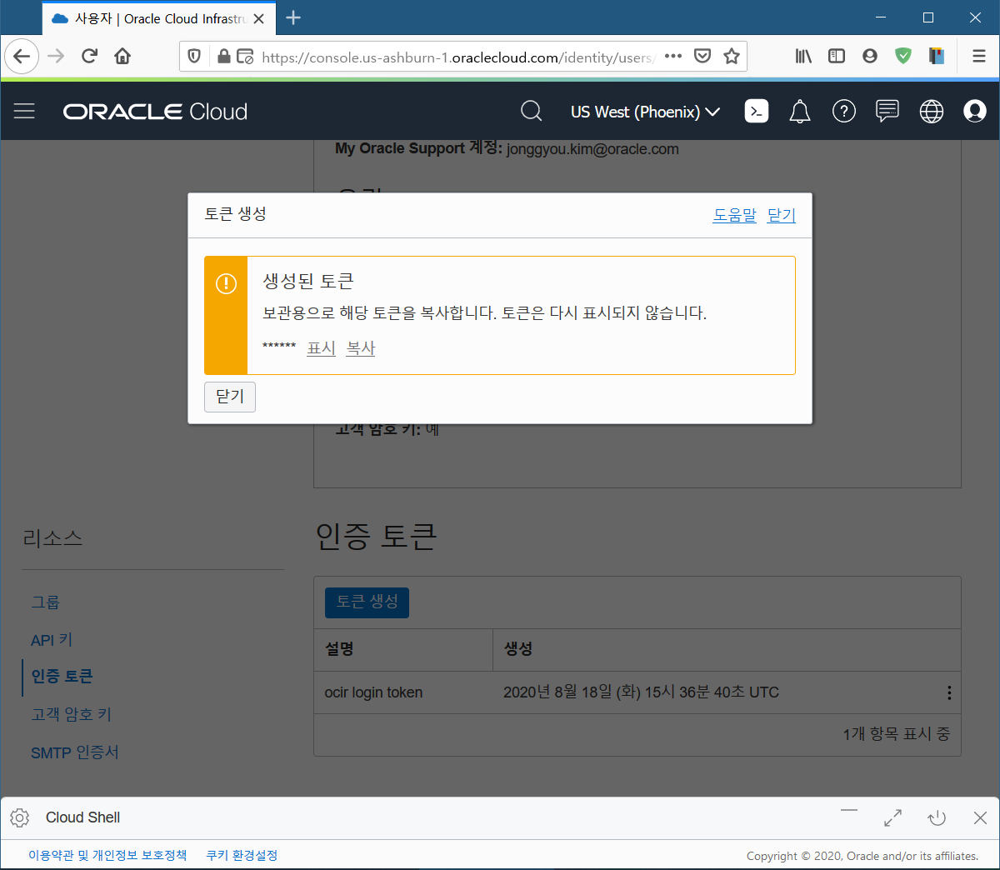

# Oracle Functions 실습

Oracle Cloud Infrastructure 의 Functions을 사용해 봅니다.

# 애플리케이션 생성

1. Functions(함수) 서비스를 수행하기 위하여 왼쪽 위 햄버거 아이콘을 눌러 `개발자 서비스 > 함수`를 클릭합니다.

    

1. `애플리케이션 생성`을 눌러 애플리케이션을 생성합니다.

    

1. 이름을 쓰고 사용하려는 VCN을 선택하고 서브넷 3개를 클릭하여 등록합니다.

    

1. 아래 `생성`을 눌러 애플리케이션을 생성합니다.

    

이 후의 과정은 개발과 배포 입니다.

# Context 설정

이 항목은 CloudShell을 기준으로 합니다. 로컬환경에서의 설정은 [여기](oci-functions-local.md)를 참조바랍니다.

1. CloudShell을 시작합니다.

    

    CloudShell이 실행되고 프롬프트가 보일것입니다.

2. 설정된 context 의 리스트를 봅니다.

    ~~~
    $ fn list context
    ~~~

    다음과 같이 미리 생성된 context들이 보입니다.

    

    현재 phonix를 사용하고 있음을 알 수 있습니다.

    다른 context를 사용하려면 다음과 같이 합니다.

    ~~~
    $ fn use context <context name>
    ~~~

    현재 context에서 그대로 사용하기 위해서는 해당 context의 리젼으로 옮겨야 합니다. 현재 context를 phonix를 사용하고 있으므로 우측 상단의 리젼을 phonix로 변경합니다.

    

    아래와 같이 현재 리젼이 바뀐것을 볼 수 있습니다.

    

# OCIR에 로그인 하기

OCI Functions의 모든 function은 docker image 입니다. docker image는 docker registry에 저장이 됩니다.

OCI는 OCIR(Oracle Cloud Infrastructure Registry)를 제공하고 있으며 이 Registry에 docker image를 push/pull 하기 위해서는 로그인을 해야 합니다.

로그인을 위한 패스워드에는 auth token이 사용됩니다. 따라서 먼저 auth token을 생성하도록 합니다.

1. 인증 토큰 생성

    우측 상위의 사용자 아이콘을 눌러 로그인 계정을 누릅니다.

    

    보이는 화면의 왼쪽 아래 "인증 토큰"을 누릅니다.

    

    "토큰생성"을 눌러 토큰을 생성합니다.

    

    생성된 토큰을 복사합니다. 토큰을 다시 볼 수 없으니 반드시 기록해 둡니다.

    

1. OCIR에 로그인

    docker registry에 로그인을 합니다.  
    ~~~
    docker login -u '<tenancy-namespace>/<user-name>' <region-key>.ocir.io
    ~~~

    현재 상태인 phenix를 위해서는 다음과 같이 합니다.

    ~~~
    $ docker login -u 'apackrsct01/oracleidentitycloudservice/jonggyou.kim@oracle.com' phx.ocir.io

    Password: <복사한 인증토큰> 
    WARNING! Your password will be stored unencrypted in /home/jonggyou_k/.docker/config.json.
    Configure a credential helper to remove this warning. See
    https://docs.docker.com/engine/reference/commandline/login/#credentials-store

    Login Succeeded
    ~~~

    Registry에 docker image를 pull/push할 준비가 완료되었습니다.

# Function 생성 및 배포, 실행

1. 첫번째 애플리케이션 생성

    이제 애플리케이션을 생성 해 봅니다.

    "애플리케이션 생성"을 눌러 진행합니다.

    

    애플리케이션의 이름과 vcn, subnet을 입력합니다.

    

    "생성"을 눌러 애플리케이션을 생성합니다.

    

    이제 생성된 애프리케이션에서 수행될 함수(Function)을 생성합니다.

1. 첫번째 function 생성

    CloudShell에서 다음과 같이 명령하여 새로운 function을 만듧니다.

    ~~~
    $ fn init --runtime java hello-java
    
    Creating function at: ./hello-java
    Function boilerplate generated.
    func.yaml created.
    ~~~

    Java를 기반으로 하는 hello-java 가 만들어 졌습니다.
    자동으로 만들어진 파일은 다음과 같습니다.
    ~~~
    $ ls hello-java
 
    func.yaml  pom.xml  src
    ~~~
    - func.yaml : Function의 속성을 설정하는 파일입니다.

        ~~~
        schema_version: 20180708
        name: hello-java
        version: 0.0.1
        runtime: java
        build_image: fnproject/fn-java-fdk-build:jdk11-1.0.110
        run_image: fnproject/fn-java-fdk:jre11-1.0.110
        cmd: com.example.fn.HelloFunction::handleRequest
        ~~~

    - pom.xml : Maven을 위한 설정파일 입니다.

    - src : maven 형식의 Java 소스 디렉토리 입니다.

1. 첫번째 function 배포

    먼저 만들어진 디렉토리로 이동합니다.
    ~~~
    $ cd hello-java
    ~~~

    그리고 컴파일을 합니다.
    ~~~
    $ fn -v deploy --app helloworld-app
    ~~~

    그럼 내부적으로는 Dockefile을 만들고 docker image를 만드는 과정을 수행합니다.

    출력되는 메시지 순서로 설명하면 다음과 같습니다.
    
    1. 먼저 func.yaml 을 읽어 어떤 환경으로 동작해야 하는지 살펴봅니다.
        ~~~
        Deploying hello-java to app: helloworld-app
        Bumped to version 0.0.2
        Building image phx.ocir.io/apackrsct01/jonggyou.kim/hello-java:0.0.2 
        FN_REGISTRY:  phx.ocir.io/apackrsct01/jonggyou.kim
        Current Context:  us-phoenix-1
        ~~~

        해당 설정에 따라 Dockerfile을 만들고 수행합니다.

    1. java 환경이라 base image인 fn-java-fdk-build image를 pull합니다.
        ~~~
        Sending build context to Docker daemon  14.34kB
        Step 1/11 : FROM fnproject/fn-java-fdk-build:jdk11-1.0.110 as build-stage
        Trying to pull repository docker.io/fnproject/fn-java-fdk-build ... 
        jdk11-1.0.110: Pulling from docker.io/fnproject/fn-java-fdk-build
        bf5952930446: Pull complete 
        092c9b8e633f: Pull complete 
        0b793152b850: Pull complete 
        7900923f09cb: Pull complete 
        538f67ffe923: Pull complete 
        4259c181cc3f: Pull complete 
        6dcd7f2876f0: Pull complete 
        4d36d6675b06: Pull complete 
        8081ea423639: Pull complete 
        bb0e99833aa9: Pull complete 
        a5a3384d2f80: Pull complete 
        df78a3f2a6ff: Pull complete 
        Digest: sha256:15b4e19efee4995c7def4caea86ba7c2f559bee7e27ed9272e841e347fd4a830
        Status: Downloaded newer image for fnproject/fn-java-fdk-build:jdk11-1.0.110
        ---> 58f0bf8b0ef2
        ~~~

    1. 소스를 넣고 mvn으로 컴파일 합니다.
        ~~~
        Step 2/11 : WORKDIR /function
        ---> Running in 37ae9c4be713
        Removing intermediate container 37ae9c4be713
        ---> 98704d475f85
        Step 3/11 : ENV MAVEN_OPTS -Dhttp.proxyHost= -Dhttp.proxyPort= -Dhttps.proxyHost= -Dhttps.proxyPort= -Dhttp.nonProxyHosts= -Dmaven.repo.local=/usr/share/maven/ref/repository
        ---> Running in c39f196eaa22
        Removing intermediate container c39f196eaa22
        ---> c67195e0d5fc
        Step 4/11 : ADD pom.xml /function/pom.xml
        ---> 0dc363488dca
        Step 5/11 : RUN ["mvn", "package", "dependency:copy-dependencies", "-DincludeScope=runtime", "-DskipTests=true", "-Dmdep.prependGroupId=true", "-DoutputDirectory=target", "--fail-never"]
        ---> Running in 3d85162a4987

        (중략..)

        [INFO] BUILD SUCCESS
        [INFO] ------------------------------------------------------------------------
        [INFO] Total time:  6.132 s
        [INFO] Finished at: 2020-08-18T14:58:16Z

        (중략..)
        ~~~

    1. Repository에 만들어진 docker image를 push 합니다.
        ~~~
        Parts:  [phx.ocir.io apackrsct01 jonggyou.kim hello-java:0.0.2]
        Pushing phx.ocir.io/apackrsct01/jonggyou.kim/hello-java:0.0.2 to docker registry...The push refers to repository [phx.ocir.io/apackrsct01/jonggyou.kim/hello-java]
        0ee0e358965c: Pushed 
        9288fb845e9f: Pushed 
        162de3904f8d: Pushed 
        06672795872d: Pushed 
        20c905ee95d1: Pushed 
        9f19035b90a4: Pushed 
        84538d59791a: Pushed 
        95c20fa5728d: Pushed 
        d0f104dc0a1f: Pushed 
        0.0.2: digest: sha256:6aaed704d0bce80d8a0c62bb1643420689e59873664b4a93324435938ccd8fe5 size: 2206
        Updating function hello-java using image phx.ocir.io/apackrsct01/jonggyou.kim/hello-java:0.0.2...
        Successfully created function: hello-java with phx.ocir.io/apackrsct01/jonggyou.kim/hello-java:0.0.2
        ~~~
    잘 배포되었는지 살펴보기 위해 먼저 app의 이름을 봅니다.
    ~~~
    $ fn ls a
    
    NAME            ID
    helloworld-app  ocid1.fnapp.oc1.phx.aaaaaaaaagkxjgjlmx7ozbc6vxpzgd7p3n5g4ptaa64jurylzsgzgftwez2q
    ~~~

    해당 helloworld-app의 funcion을 봅니다.
    ~~~
    $ fn ls f helloworld-app
    
    NAME            IMAGE                                                   ID
    hello-java      phx.ocir.io/apackrsct01/jonggyou.kim/hello-java:0.0.2   ocid1.fnfunc.oc1.phx.aaaaaaaaacbhysmzbrcpeecjynwv6av5egtxzyngzcfw6sfw24necm56r57a

    ~~~

1. 첫번째 function 실행

    function을 실행하면 방금전 

    invoke를 사용하여 실행해 봅니다.
    ~~~
    $ fn invoke helloworld-app hello-java

    Hello world!
    ~~~

    처음 실행에는 docker container로 올리기 위한 시간이 필요합니다.

---
### 참고
- https://www.oracle.com/webfolder/technetwork/tutorials/infographics/oci_faas_gettingstarted_quickview/functions_quickview_top/functions_quickview/index.html
