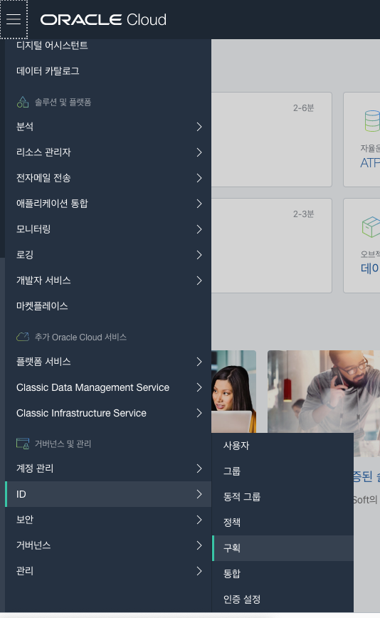

# Oracle Functions 실습

참조 : https://www.oracle.com/webfolder/technetwork/tutorials/infographics/oci_faas_gettingstarted_quickview/functions_quickview_top/functions_quickview/index.html

# OCI CLI 설치
Mac / Linux
~~~
bash -c "$(curl -L https://raw.githubusercontent.com/oracle/oci-cli/master/scripts/install/install.sh)"
~~~

## OCI 설치 오류 시 (for Mac)

주의할 사항은 SSL CERTIFICATION 에서 오류가 나면 Install Certificates.command 를 수행하면 된다. brew 로 설치하면 수행하고자 하는 Command 가 없다. 그래서 python3 를 다시 설치한다. https://www.python.org/downloads/ 에서 다운받아 설치한다. 

새로운 Python 을 설치 후 */Applications/Python 3.8/Install\ Certificates.command* 를 실행한다.

~~~
$ ./Install\ Certificates.command
 -- pip install --upgrade certifi
Collecting certifi
  Downloading https://files.pythonhosted.org/packages/b9/63/df50cac98ea0d5b006c55a399c3bf1db9da7b5a24de7890bc9cfd5dd9e99/certifi-2019.11.28-py2.py3-none-any.whl (156kB)
     |████████████████████████████████| 163kB 186kB/s
Installing collected packages: certifi
Successfully installed certifi-2019.11.28
WARNING: You are using pip version 19.2.3, however version 20.0.2 is available.
You should consider upgrading via the 'pip install --upgrade pip' command.
 -- removing any existing file or link
 -- creating symlink to certifi certificate bundle
 -- setting permissions
 -- update complete
 ~~~

# OCI 환경 설정

설정을 하기 위해서 다음 명령을 입력한다.
~~~
oci setup config
~~~

입력해야 할 부분은 다음과 같다.

- Enter a user OCID: 

    user OCID 값은 User Settings(사용자 설정) 화면의 중간에 User Information(사용자 정보) 항목에 있다. Copy(복사) 버튼을 누르면 복사된다.

    
    
    
    
- Enter a tenancy OCID: 

    tenancy OCID 값은 태넌시 정보 화면의 중간에 Tenancy Information(태넌시 정보) 항목에 있다. Copy(복사) 버튼을 누르면 복사된다.

    

    

- Enter a region (e.g. eu-frankfurt-1, uk-london-1, us-ashburn-1, us-phoenix-1): 
    region은 상단 우측에 존재한다.

    

나머지 key 에 해당하는 부분은 Enter 만 입력하도록 한다.

# 생성된 공개키 등록

공개키 값을 복사한다.

~~~
cd ~/.oci
cat oci_api_key_public.pem
~~~

**-----BEGIN PUBLIC KEY-----** 부터 **-----END PUBLIC KEY-----** 까지 모두 복사한다.

사용자 세부정보를 본다.

아래의 **공개키 추가** 를 선택한다.

좀 전에 복사한 공개키 값을 붙여넣기하고 **추가**를 누른다.

잘 동작하는지 체크한다.

~~~
oci os ns get
~~~

오류가 나지 않고 값이 나오면 설정이 완료되었다.

# Fn 설치

[Fn project](fn-project.md) 를 참조한다.

# Fn context 생성

다음의 형식으로 context를 생성한다.
~~~
fn create context <my-context> --provider oracle
~~~

*myoci* 라는 이름의 context를 생성하려면 다음과 같이 한다.
~~~
$ fn create context myoci --provider oracle
Successfully created context: myoci
~~~

*oci* context를 사용한다.
~~~
$ fn use context myoci
Now using context: myoci
~~~

# Fn context OCI 설정

## oracle.profile 설정

Oracle Cloud Infrastructure와 연결을 위해서 oracle.profile 을 설정한다.
~~~
fn update context oracle.profile <profile-name>
~~~

`oci setup config`을 통해서 설정한 프로파일은 다음과 같다.
~~~
$ cat ~/.oci/config
[DEFAULT]
user=ocid1.user.oc1..aaaaaaaab4xjody4hvk7<생략>3bfqnf3jj2ffoata
fingerprint=68:50:fa<생략>8:d1:15:74
key_file=/Users/jonggyoukim/.oci/oci_api_key.pem
tenancy=ocid1.tenancy.oc1..aaaaaaaa6ma7kq3bs<생략>xihlbcemkklrsqa
region=us-ashburn-1
~~~
해당 프로파일의 명은 **DEFAULT** 이며 이 프로파일을 지정해 준다.
~~~
$ fn update context oracle.profile DEFAULT
Current context updated oracle.profile with DEFAULT
~~~

## oracle.compartment-id 설정

## api-url 설정

## registry 설정

1. auth token 생성
1. Registry 로그인

# Function 생성 및 배포, 실행

1. 첫번째 애플리케이션 새엇ㅇ
1. 첫번째 function 생성
1. 첫번째 function 배포
1. 첫번째 function 실행
1. 다음단계
